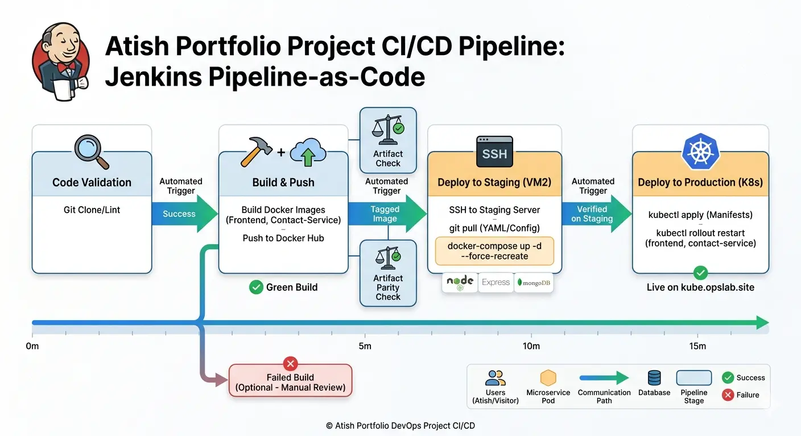

# atish-portfolio-website

# End-to-End DevOps Project: Portfolio & Microservices Orchestration

## 🚀 Project Overview
This project demonstrates a full-scale DevOps lifecycle for a microservices-based portfolio website. It transitions a manual deployment process into a fully automated CI/CD pipeline, moving code from a local environment to a Staging environment (Docker Compose) and finally to a Production-grade self-managed Kubernetes cluster.

### Key Highlights:
* **Infrastructure:** Self-managed Kubernetes Cluster (1 Master, 2 Worker Nodes) on AWS EC2.
* **CI/CD:** Automated Jenkins pipelines with build-once, deploy-anywhere logic.
* **Architecture:** Microservices-based (Frontend + Contact Service + MongoDB).
* **Security:** SSL/TLS integration via Cert-Manager and Nginx Ingress Controller.

---

## 🛠 Tech Stack
* **Cloud:** AWS (EC2, Route53, VPC, Security Groups)
* **Orchestration:** Kubernetes (Kubeadm setup), Docker Compose
* **CI/CD:** Jenkins (Pipeline-as-Code), SSH Agent, Docker Hub
* **Web/Proxy:** Nginx Ingress Controller, Let's Encrypt
* **Database:** MongoDB
* **Backend:** Node.js / Express
* **Frontend:** HTML/CSS/JS

---

## 🏗 Infrastructure Architecture
The infrastructure is designed for high availability and environment parity:

1.  **Jenkins Server:** Acts as the build agent and orchestrator.
2.  **Staging Environment (VM2):** Uses Docker Compose to verify "Artifact Parity" before production.
3.  **Production Cluster:** A 3-node Kubernetes cluster managed via `kubeadm`.
    * **Control Plane:** Manages cluster state and API.
    * **Worker Nodes:** Host the application workloads.

---

## 🚀 CI/CD Pipeline Workflow
The Jenkinsfile is configured with the following stages:

1.  **Code Validation:** Pulls the latest code from GitHub.
2.  **Build & Push:** * Builds Docker images for `frontend` and `contact-service`.
    * Pushes tagged images to Docker Hub.
3.  **Deploy to Staging:** * SSH into the Staging VM.
    * Pull the latest YAML configuration.
    * Force-recreate containers using the newly built images from Docker Hub.
4.  **Deploy to Production (K8s):**
    * Updates the Kubernetes manifests.
    * Performs a `rollout restart` on the deployments to ensure zero-downtime updates and fresh image pulls.

